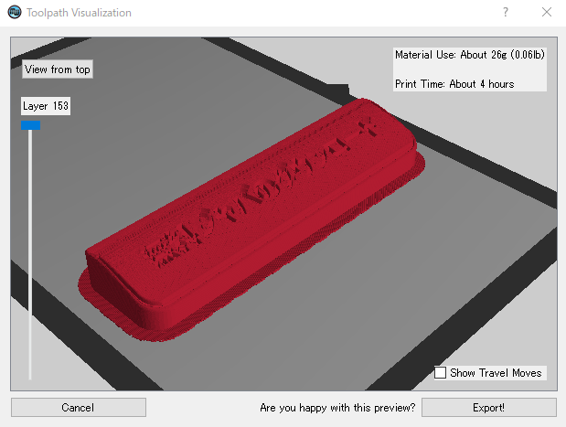
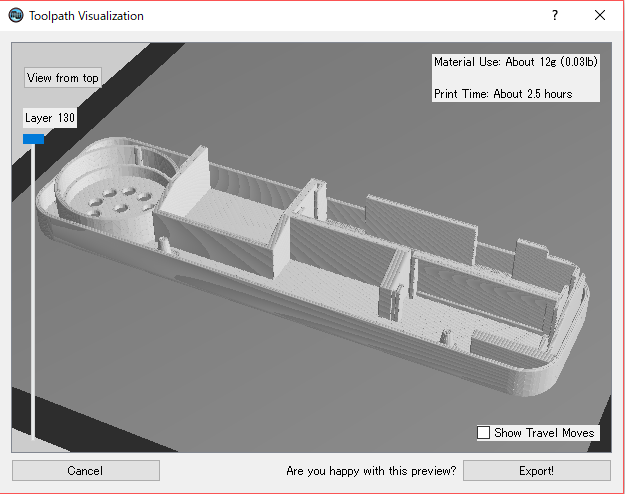

# RealJavaButton v2

JavaButton on the real world.

The goal of v2 is which provides an easy way to make JavaButton.

* 対象年齢: 全年齢 (審査申請準備中)

## 作例

Front(ver 2.0):

Back(ver 1.0):

Bottom(ver 1.0):

Inside(ver 0.9):

* TODO: 背面を最新のもので撮影
* TODO: 底面を最新のもので撮影
* TODO: 内部を最新のもので撮影

## Resources

* For 3D printing:
  * Top Cover Model([STL](./models/case-lid02.stl), [.f3d(Fusion360)](./models/case-lid02.f3d), [online](http://a360.co/2zoEj2t)

    

    * Label ([STL](./models/case-lid02-label.stl), [.f3d(Fusion360)](./models/case-lid02-label.f3d), [online](http://a360.co/2zqsTeh))

      

  * Bottom Model([STL](./models/case-bottom04.stl), [.f3d(Fusion360)](./models/case-bottom04.f3d), [online](http://a360.co/2umziJ7))
    

## Bill of materials

部品リスト

* [FN-M16P 互換 Audio Module](https://www.amazon.co.jp/dp/B01D1D0E7Q/) x1
  ( [datasheet](http://www.trainelectronics.com/Arduino/MP3Sound/TalkingTemperature/FN-M16P%20Embedded%20MP3%20Audio%20Module%20Datasheet.pdf) )

* [OMRON D2FC互換マイクロスイッチ](https://www.amazon.co.jp/dp/B00YM2Q178/) x2
* スイッチ取り付け用基盤(71 x 8.5mm 程度に加工) x1
* 8ohm 0.25w スピーカー (⌀27mm)  x1
* 適当な耐熱電子ワイヤー(銅線) x 10本程度
* 電池ボックス用金具 それぞれ幅 11mm 以内:
  * プラス側 金具 x1
  * マイナス側 金具 x1
  * プラスマイナス 金具 x1
* 単5電池 1.5V  x3

参考情報:

* 参考: Audio Module に関して、リンク先での購入は、2つのうち1つは動かない覚悟で。
* 参考: スピーカー取り付け用基板は、 ユニバーサル基盤から切り出した。
* 参考: スピーカーは、100均のおもちゃのピアノから流用。
* 参考: 電池ボックス用金具らは、100均のおもちゃから流用。
* 参考: 単5電池のプラマイは間違えやすく、ショートしやすいので注意。(要改善)

## Schematic

You can open `schematic/main.pro` using `KiCad` v4.x.x , if you want to see/edit those schematics.

## Confirmed environments(確認済み環境)

作例に使ったものです。

* For 3D printing
  * Printer: [QIDI技術3Dプリンター/ ABS / PLA 1.75mm デュアル押出/色](https://www.amazon.co.jp/dp/B01CRNV038/)
    * FDM Type(熱溶解積層法)
    * ノズル: ⌀0.4mm
    * Model: 3DF-QD-ABSYW
  * Filament : **ABS** (プリンタ付属)
  * Slicer Software: MakerWare 2.4.1.24 (プリンタ付属, 設定済み)
  * Platform Sheet: [3M プラットフォームシート](https://www.amazon.co.jp/dp/B01M11XI4Y)

      印刷中に台から離れないようにするために利用。
  * 出力設定(後述)
* Software
  * CAD/CAM: **Autodesk Fusion360**

## Configurations to export from slicer (MakerWare)

Exaples:

* Top cover:

  

  Preview:

  

* Label for top cover:

  

  Preview:

  

* Bottom case: (v1.xと同型)

  

  Preview:

  

## License

[Unlicense](./LICENSE)
