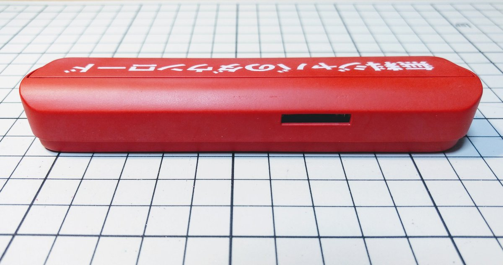
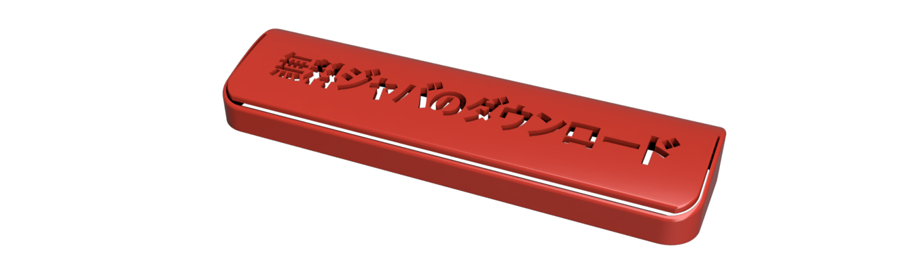

# RealJavaButton v1

JavaButton on the real world.

* 対象年齢: 全年齢 (審査申請準備中)

## Examples

Front(ver 1.0):

Back(ver 1.0):

Bottom(ver 1.0):

Inside(ver 1.0):

## Resources

* For 3D printing:
  * Top Cover Model([STL](./models/case-lid01.stl), [.f3d(Fusion360)](./models/case-lid01.f3d), [online](http://a360.co/2t33CEH))
    
  * Bottom Model([STL](./models/case-bottom03.stl), [.f3d(Fusion360)](./models/case-bottom03.f3d), [online](http://a360.co/2umziJ7))
    
  * Masking Sheet 印刷用:
    * [PDF](./images/javabutton_label00_170x225mm.pdf)
    * [Illustrator形式(.ai)](./images/javabutton_label00_170x225mm.ai)
    * [同 outline化済(.ai)](./images/javabutton_label00_170x225mm(outline).ai)

    

    * (印刷には不要) 元データ:
    [Illustrator形式](./images/javabutton-string-only.ai)
    ([outline化済](./images/javabutton-string-only(outline).ai)))

## Bill of materials

部品リスト

* [FN-M16P Compatible Audio Module](https://www.amazon.co.jp/dp/B01D1D0E7Q/) x1
  ( [datasheet](http://www.trainelectronics.com/Arduino/MP3Sound/TalkingTemperature/FN-M16P%20Embedded%20MP3%20Audio%20Module%20Datasheet.pdf) )

* [OMRON D2FC Compatible Micro Switch](https://www.amazon.co.jp/dp/B00YM2Q178/) x2
* Cut universal board for Micro switch, about 71 x 8.5mm.(スイッチ取り付け用基盤をカットして用意) x1
* 8ohm 0.25w Speaker (⌀27mm)  x1
* Some short wires(短い導線いくつか)
* Battery contact(電池ボックス用金具) それぞれ幅 11mm 以内:
  * プラス側 金具 x1
  * マイナス側 金具 x1
  * プラスマイナス 金具 x1
* Battery: 1.5V N Cell(R1, 単5電池, 12x30.2mm)  x3

参考情報:

* 参考: Audio Module に関して、リンク先での購入は、2つのうち1つは動かない覚悟で。
* 参考: スピーカー取り付け用基板は、 ユニバーサル基盤から切り出した。
* 参考: スピーカーは、100均のおもちゃのピアノから流用。
* 参考: 電池ボックス用金具らは、100均のおもちゃから流用。
* 参考: 単5電池のプラマイは間違えやすく、ショートしやすいので注意。(要改善)

## Schematic

You can open `schematic/main.pro` using `KiCad` v4.x.x , if you want to see/edit those schematics.

## Confirmed environments(確認済み環境)

* For 3D printing
  * Printer: [Qidi Technology Dual Extruder Color 3D Printer / ABS / PLA 1.75mm デュアル押出/色](https://www.amazon.co.jp/dp/B01CRNV038/)
    * FDM Type(Fused deposition modelling, 熱溶解積層法)
    * Nozzle Diameter: ⌀0.4mm
    * Model: 3DF-QD-ABSYW
  * Filament : **ABS** (attached in the printer)
  * Slicer Software: MakerWare 2.4.1.24 (attached in the SD card, configured)
  * Platform Sheet: [3M platform Seat](https://www.amazon.co.jp/dp/B01M11XI4Y)
  * Configurations(see below)
* For painting:
  * 塗料等
    * サーフェサ: [ファインサーフェイサー(ピンク)](https://www.amazon.co.jp/dp/B00BBPUKDA)
    * 赤: [Mr.カラー キャラクターレッド(半光沢)](https://www.amazon.co.jp/dp/B0049FD5CC)
    * 白: [Mr.カラー スプレー S62 つや消しホワイト(つや消し)](https://www.amazon.co.jp/dp/B0049FBLFU)
    * 仕上げ材: [GSIクレオス Mr.トップコート(つや消し)](https://www.amazon.co.jp/dp/B0000WS12C)
  * パテ等
    * [ポリパテ](https://www.amazon.co.jp/dp/B000BMX1BM): 積層をなだらかにするため
    * [ラッカーパテ](https://www.amazon.co.jp/dp/B000R9N5VU): キズ埋めのため
  * [マスキングシール](https://www.amazon.co.jp/dp/B004WBC07Y):

      ジャバ文字の塗装用マスキングシート
  * デザインナイフ, ヘラ, 等々
  * ヤスリ: 320, 800, 1200(いずれも耐水性)
    * (あれば楽) [タイラー](https://www.amazon.co.jp/dp/B0026O9H6G)
      * 元のを剥がし、必要なヤスリを貼って使っている
    * 粉塵が出にくく、目詰まりしにくいため、水研ぎが楽
  * (あれば) 塗装ブース
* Software
  * CAD/CAM: **Autodesk Fusion360**

## Configurations to export from slicer (MakerWare)

Exaples:

* Top cover:

  

  Preview:

  

* Bottom case:

  

  Preview:

  

## Appendix: Examples of printing labels

文字塗装の例:

1. マスキングシートの裏に、文字列を印刷する。シートからマスキングを切り抜く。(データは前述)

    

1. 塗装済みのジャバボタンに貼る。スプレーされてもいいいように、マスキングシートの周りをマスキングする。(土台の利用は塗装を簡単にするため)

    

1. 二度ほど白スプレーを吹き、乾いたのち仕上げ材を吹き、乾いたら出来上がり

    

    (※写真は試作中のものです)

## License

[Unlicense](./LICENSE)
